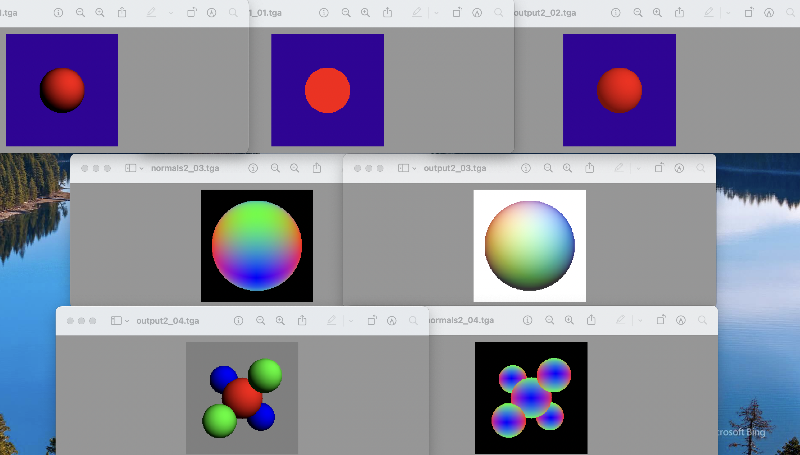
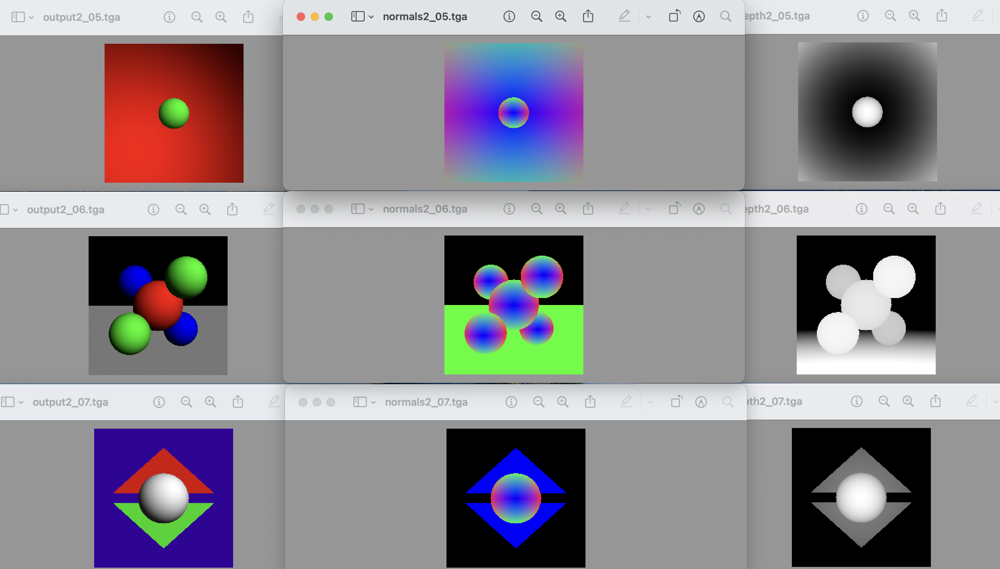
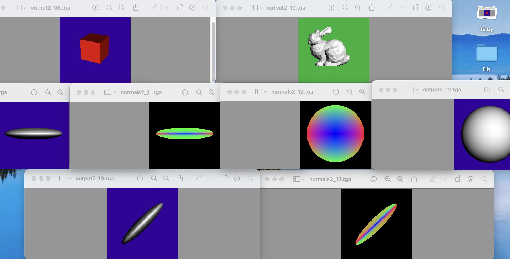
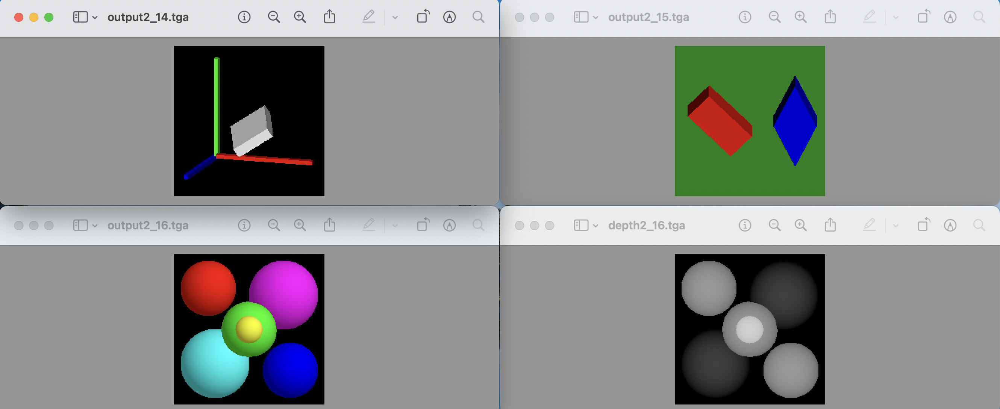
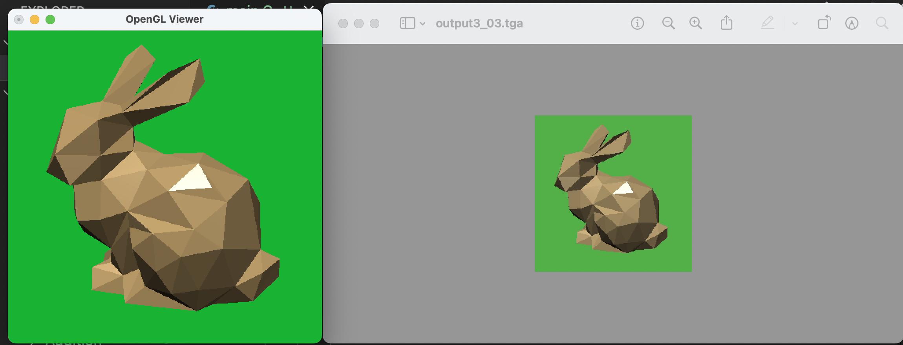
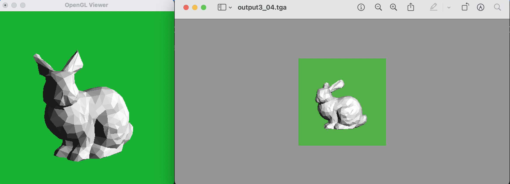
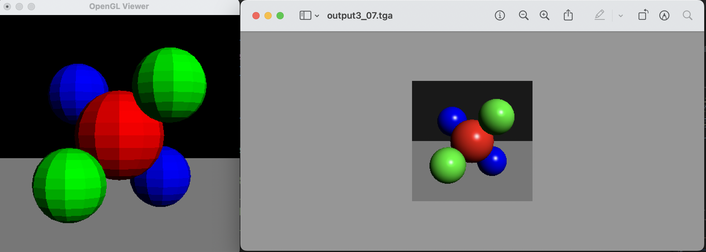
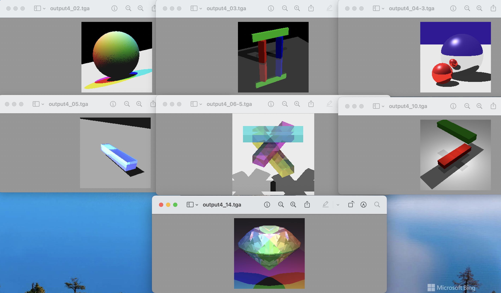

# MIT6.837-CG-Fall2004-Assignment
### Computer Graphics

## Lesson Material
Course Calendar:
https://groups.csail.mit.edu/graphics/classes/6.837/F04/calendar.html

The folder includes the following, which are downloaded from the Course website\
*1.Lecture Note*\
*2.Original Assignments, including PDF task requirement and supporting code.*

## Project Introduction
#### Assignment0: [**Very Interesting!**]

    Self-similar fractals (a subpart of the object is similar to the whole) 
    Barnsley fern\dargon\X\Triangle\Levy
    IFS Function

A glimpse of it ⬇

#### Assignment1: [Ray Casting]

    Sphere-Ray Intersection-(Geometric/Algebraic)  
    Orthonormal Basis - from Linear Algebra
    C++ Object Oriented Programming

A glimpse of it ⬇

*scene1_07.txt sample output is wrong* \
（Use scene1_08.txt，camera center 0,0,2 instead）\
Proved by linking two sphere functions, which turn out to be an oval on plane XOY.

#### Assignment2: [Ray Tracing]

    NormalVisualization/ DiffuseShading
    Perspective Camera
    New primitives- Planes & Triangles
    Affine Transformations 

A glimpse of it ⬇

"-shade_back" to be updated.

#### Assignment3: [Open GL]

    OpenGL API - 3D Simulation
    Sphere Tessellation & Gouraud interpolation
    DirectionalLight
    Specular Color
    
A glimpse of it ⬇

 
Guidance:
*Within the real-time interface*\
 Calling the render function by pressing 'r'.\
 The application can be terminated by pressing 'q' or calling exit().*

*Adjustment
Some head files in ray folder is being cut to Object3D folder.\
Codes have been revised.

Command Line Argument: in/... out/...\
Set the vertex normal before specifying each vertex position\
Blinn-Phong Model the exponent->100 (nonlinear relationship)

#### Assignment4: [Ray Tracer]

    Shadows Reflection & Refraction
    OpenGL API Representation
    PointLight

A glimpse of it ⬇

 
*Adjustment
Tessellation args can be controlled by Command Line Arguments.
On Main.C 
    a new pointer to SceneParser -> no need for function arg 
                                 -> openGL rendering enabled. (camera adjusted)
On raytrace.h  
    main loop raycasting has been transferred here.

## Setup the MyProject
*Notice that .C = .cpp (at least in VScode)

From Assignment3 onwards, include the below header Files on Mac instead.
    
    #define GL_SILENCE_DEPRECATION
    // Defined before OpenGL and GLUT includes to avoid deprecation messages 
    #include <OpenGL/gl.h> 
    #include <OpenGL/glu.h> 
    #include <GLUT/glut.h> 

    In task.json
        "-framework" ,"GLUT"," -framework", "OpenGL"

    Add glutInit(&argc, argv); in main
        change glEnable() etc after glutCreateWindow("OpenGL Viewer");

    *Adjustment
    In addition, some head files in ray folder is being cut to Object3D folder.\
    Codes have been revised.

### Using VSCode C++ 
Using my code (on Mac Clang++)\
Note that you should open the Myproject folder,\
/lib contains vector-matrix-image header files or .C\
/ray contains the other.

You should replace four files in .vscode (in Myproject folder) with those from each corresponding .vscode-assignment*(0-9) (in assignment folder).\
.vscode-assignment*(0-9) is used for coding via the Myproject folder.

*In assignment 0, there are two ".vscode" folders\
.vscode-assignment0 is used for coding via the Myproject folder.\
.vscode-inside is used for coding via the assignment0_Barnsley fern folder. \
DO NEED to include everything from lib folder.

### Using Viusal Studio
Try doing it yourself.
