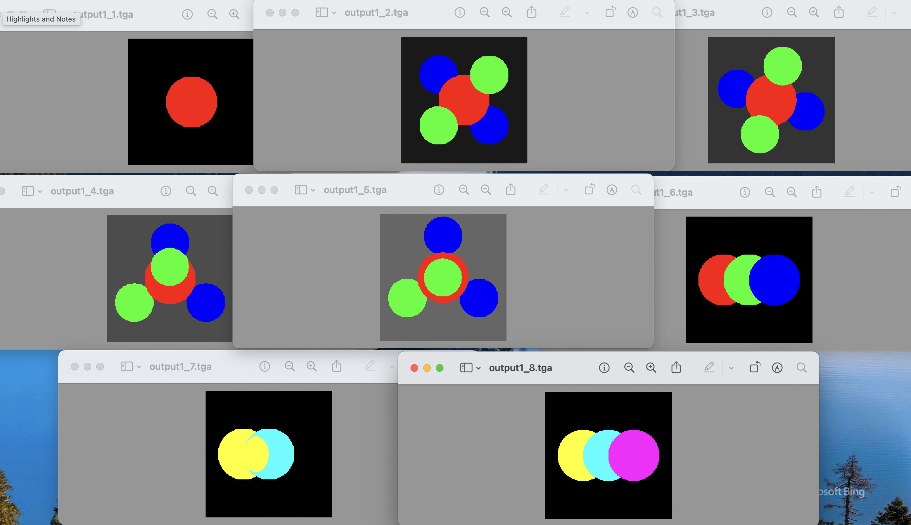
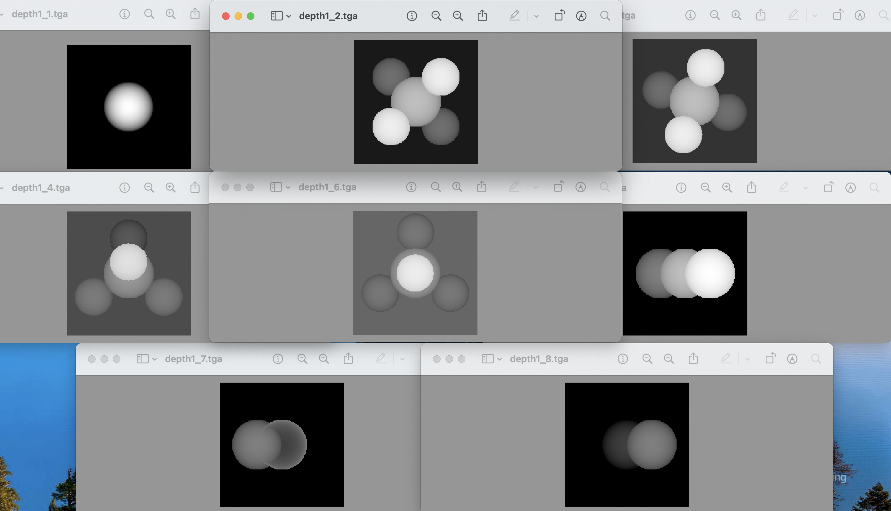

# MIT6.837-CG-Fall2004-Assignment
### Computer Graphics

## Lesson Material
Course Calendar:
https://groups.csail.mit.edu/graphics/classes/6.837/F04/calendar.html

The folder includes the following, which are downloaded from the Course website\
*1.Lecture Note*\
*2.Original Assignments, including PDF task requirement and supporting code.*

## Project Introduction
Assignment0: [**Very Interesting!**]

    Self-similar fractals (a subpart of the object is similar to the whole) 
    Barnsley fern\dargon\X\Triangle\Levy
    IFS Function

A glimpse of it ⬇

Assignment1: [Ray Casting]

    Sphere-Ray Intersection-(Geometric/Algebraic)  
    Orthonormal Basis - from Linear Algebra
    C++ Object Oriented Programming

A glimpse of it ⬇

*scene1_07.txt sample output wrong（use scene1_08.txt，camera center 0,0,2 instead）
Proved by linking two sphere function, which turns out to be an oval on XOY.

## Setup the MyProject
*Notice that .C = .cpp (at least in VScode)
### Using VSCode C++ 
Using my code (on Mac Clang++)\
Note that you should open the Myproject folder,\
/lib contains vector-matrix-image header files or .C\
/ray contains the other.

You should replace four files in .vscode (in Myproject folder) with those from each corresponding .vscode-assignment*(0-9) (in assignment folder).\
.vscode-assignment*(0-9) is used for coding via the Myproject folder.

*In assignment 0, there are two ".vscode" folders\
.vscode-assignment0 is used for coding via the Myproject folder.\
.vscode-inside is used for coding via the assignment0_Barnsley fern folder. \
DO NEED to include everything from lib folder.

### Using Viusal Studio
Try doing it yourself.
